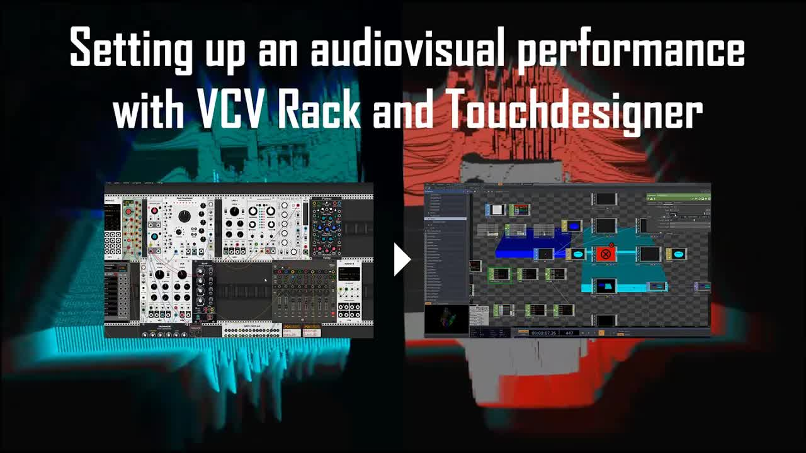

# Setting-up-an-audiovisual-performance-with-VCV-Rack-and-Touchdesigner

  <picture>
    
  </picture>

 

---

## Video Information

| Property | Value |
|----------|-------|
| **Video Name** | `Setting-up-an-audiovisual-performance-with-VCV-Rack-and-Touchdesigner` |
| **Original Link** | [YouTube Video](https://www.youtube.com/watch?v=MA3Zb6D83aw&list=WL&index=6) |
| **Total Size** | **5 parts** - **217.35 MB** |
| **Quality** | **best** |
| **Status** | **Complete (100%)** |
| **Password Protected** | **NO** |

---

## Download Links

> ⬇️ Download **all parts**, then open `Setting-up-an-audiovisual-performance-with-VCV-Rack-and-Touchdesigner.zip` — the other parts are found automatically.

| # | File | Link |
|---|------|------|
| 1 | `Setting-up-an-audiovisual-performance-with-VCV-Rack-and-Touchdesigner.z01` | [Download](https://raw.githubusercontent.com/MasoudYazdi/Ourtube/main/videos/Setting-up-an-audiovisual-performance-with-VCV-Rack-and-Touchdesigner/Setting-up-an-audiovisual-performance-with-VCV-Rack-and-Touchdesigner.z01) |
| 2 | `Setting-up-an-audiovisual-performance-with-VCV-Rack-and-Touchdesigner.z02` | [Download](https://raw.githubusercontent.com/MasoudYazdi/Ourtube/main/videos/Setting-up-an-audiovisual-performance-with-VCV-Rack-and-Touchdesigner/Setting-up-an-audiovisual-performance-with-VCV-Rack-and-Touchdesigner.z02) |
| 3 | `Setting-up-an-audiovisual-performance-with-VCV-Rack-and-Touchdesigner.z03` | [Download](https://raw.githubusercontent.com/MasoudYazdi/Ourtube/main/videos/Setting-up-an-audiovisual-performance-with-VCV-Rack-and-Touchdesigner/Setting-up-an-audiovisual-performance-with-VCV-Rack-and-Touchdesigner.z03) |
| 4 | `Setting-up-an-audiovisual-performance-with-VCV-Rack-and-Touchdesigner.z04` | [Download](https://raw.githubusercontent.com/MasoudYazdi/Ourtube/main/videos/Setting-up-an-audiovisual-performance-with-VCV-Rack-and-Touchdesigner/Setting-up-an-audiovisual-performance-with-VCV-Rack-and-Touchdesigner.z04) |
| 5 | `Setting-up-an-audiovisual-performance-with-VCV-Rack-and-Touchdesigner.zip` | [Download](https://raw.githubusercontent.com/MasoudYazdi/Ourtube/main/videos/Setting-up-an-audiovisual-performance-with-VCV-Rack-and-Touchdesigner/Setting-up-an-audiovisual-performance-with-VCV-Rack-and-Touchdesigner.zip) |

---

## How to Extract

Download all parts into the **same folder**, then:

| OS | Steps |
|----|-------|
| **Windows** | Double-click `Setting-up-an-audiovisual-performance-with-VCV-Rack-and-Touchdesigner.zip` — opens in Explorer, WinRAR, or 7-Zip automatically |
| **Mac** | Double-click `Setting-up-an-audiovisual-performance-with-VCV-Rack-and-Touchdesigner.zip` — extracts with Archive Utility or The Unarchiver |
| **Linux** | `unzip Setting-up-an-audiovisual-performance-with-VCV-Rack-and-Touchdesigner.zip` or right-click → Extract Here (Ark/File Manager) |
| **Android** | Tap `Setting-up-an-audiovisual-performance-with-VCV-Rack-and-Touchdesigner.zip` in your file manager — or use [ZArchiver](https://play.google.com/store/apps/details?id=ru.zdevs.zarchiver) |

---

*This tool created by [avasam.ir](https://avasam.ir)*
